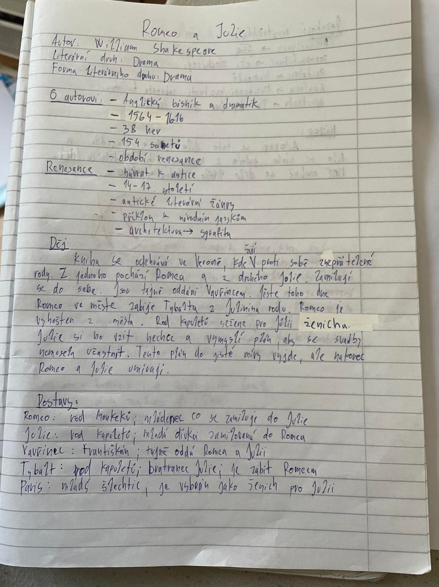

# Romeo a Julie

- Autor: Wiliam Shakespeare
- Rok vydání: 1595
- Literární druh: Drama
- Žánr: Drama

## Renesance

- Návrat k antice
- 14-16 století
- důraz na teoretické uvažování o literatuře
- Renesanční literární kritika vyžadovala:
  - velkolepost
  - půvab
  - rozmanitost
  - podobnost

## Další autoři:

- Giovanni Boccaccio:
  - Dekameron
- Francesco Petrarca:
  - básník
- Leonardo da Vinci

## Další díla:

- Hamlet
- Král Lear

## Inspirace

Někteří shakespearologové kladou vznik této tragédie do začátků Shakespearova působení v herecké skupině lorda komořího. Námět, nešťastný osud dvou milenců pocházejících ze dvou navzájem znepřátelených rodin, je snad starý jako lidstvo samo

## Jazyk

- V díle je využita
  - próza
  - poezie
  - metafory
  - figury
  - použit vytříbený a vznešený styl, který je tak typický pro Shakespearova díla
- Často se objevují
  - jmenné tvary přídavných jmen
  - citově zabarvené výrazy
  - inverze

## Kritika

- Prvním známým kritikem hry byl deníkář Samuel Pepys, který v roce 1662 napsal: "Je to hra sama o sobě nejhorší, jakou jsem kdy v životě slyšel."Básník John Dryden o deset let později hru a její komickou postavu Merkucia pochválil: "Kritika hry v 18. století byla sice méně skoupá, ale neméně rozpolcená.Shakespear ve svém Merkuciovi předvedl to nejlepší ze svého umění a sám řekl, že byl nucen ho ve třetím dějství zabít, aby ho nezabil. Nakladatel Nicholas Rowe byl prvním kritikem, který se zamyslel nad tématem hry, které viděl jako spravedlivý trest pro dva znepřátelené rody. V polovině století spisovatel Charles Gildon a filozof lord Kames tvrdili, že hra je neúspěšná, protože se neřídí klasickými pravidly dramatu: k tragédii musí dojít kvůli nějaké charakterové vadě, nikoliv kvůli náhodě osudu. Spisovatel a kritik Samuel Johnson ji však považoval za jednu z "nejpříjemnějších" Shakespearových her.

- V pozdější části 18. a v průběhu 19. století se kritika soustředila na debaty o morálním poselství hry. Adaptace herce a dramatika Davida Garricka z roku 1748 Rosalinu vyloučila: Romeo, který ji opustil kvůli Julii, byl považován za nestálého a lehkomyslného. Kritici, jako například Charles Dibdin, tvrdili, že Rosalina byla do hry zařazena proto, aby ukázala, jak lehkomyslný byl hrdina, a že to byl důvod jeho tragického konce. Jiní tvrdili, že mnich Vavřinec může být Shakespearovým mluvčím, který varuje před zbytečným spěchem. Na počátku 20. století tyto morální argumenty zpochybňovali kritici, jako byl Richard Green Moulton: tvrdil, že ke smrti milenců vedla náhoda, a nikoli nějaká charakterová vada

- Názory na hru byly smíšené, později se začali dívat na smysl a poselství díla

