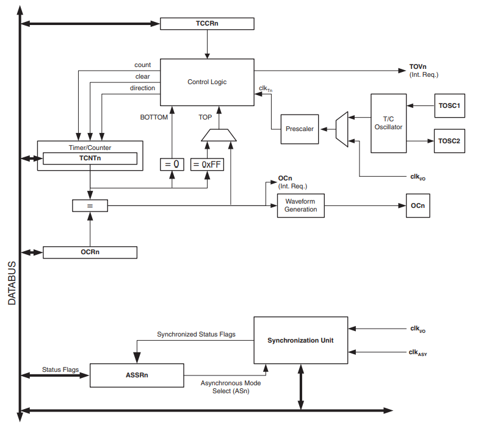
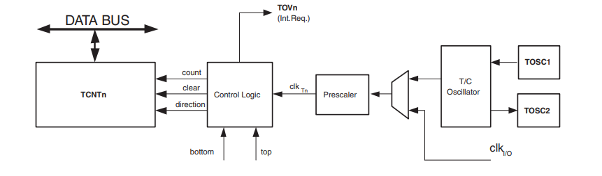
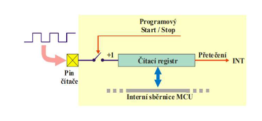
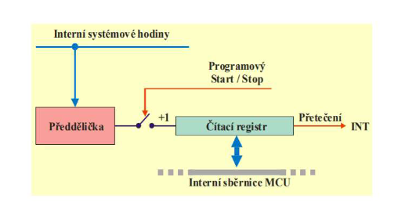
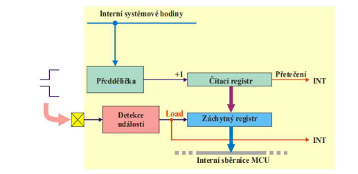
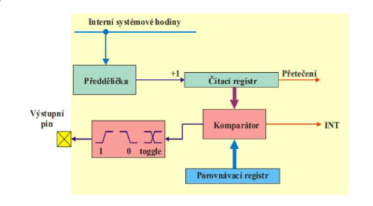
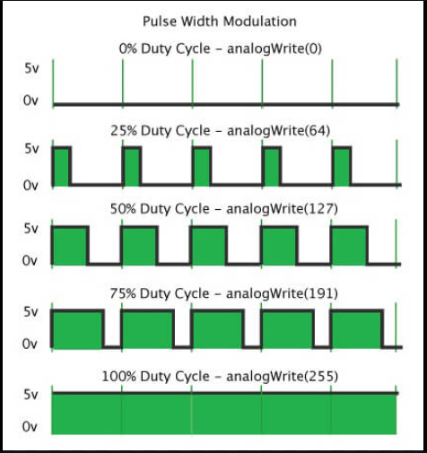
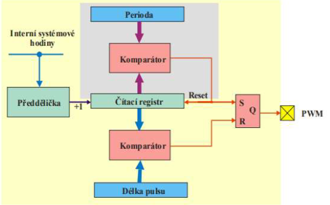

# 05 - Čítačové podsystémy mcu

`Režim čítače/časovače, podrobný popis pro Atmel AVR. Režimy CAPTURE, COMPARE, PWM.
Dohlížecí časovač WDT`

<a href='https://www.electronicwings.com/avr-atmega/atmega1632-timer'>Dokumentace</a>

- je to register
- přičítá nebo odečítá jedničku
- když přeteče dostanu o tom zmínku
- využití
  - WD timer
  - Generování přenosové rychlosti

- `TCNTn` -> timer/counter
- `OCRn` -> output compare register
  - snížení maximální hodnoty čítače
  - porovnává se s aktuální hodnotou čítače
  - dostaneme znamení o dosažené hodnotě

- `count Increment or decrement TCNT0 by 1`
- `direction Selects between increment and decrement`
- `clear Clear TCNT0 (set all bits to zero)`
- `clkT0 Timer/Counter clock`
- `top Signalizes that TCNT0 has reached maximum value`
- `bottom Signalizes that TCNT0 has reached minimum value (zero)`

## Co to je čítač

- ATMega64

  - 2x 8bit
  - 1x 16bit

- počítá pulsy vnějšího signálu
- připojen na externí pin
- třeba tlačítka nebo jiná externí vstupní periferie

## Co to je časovač

- počítá pulsy vnitřího signálu
- obvykle clock signál procesoru
- lze generovat přesné časové prodlevy (čeká)

- prescaler zvyšuje 'velikost'
  - dělí puls proto register nepřeteče tak rychle

## Capture

- zachycení vnější události
- umožňuje zachytit okamžik, kdy na pinu dojde ke změně úrovně
- zaznamená hodnotu v tomto okamžiku do záchytného registru

## Compare

- časovač doplněn komparátorem a porovnávacím registrem
- vyšle signál, když je hodnota v čítači a OCRn stejná

## PWM

- pulse width modulation
- mohu měnit periodu a střídu
- slouží pro generování signálu s nastavitelnou střídou a periodou
- střída = délka puslu / perioda

<image src="./images/pwm3.png">

 

## Watch Dog timer

- Na reset je speciální instrukce (WRD)
- monitoruje běh programu
- když SW neresetuje WDT tak WDT resetuje systém
- v případě zaseknutí resetuje mikrokontoler
- pracuje nezávisle na systémovém clock signálu
- má vlastní oscilátor
- také na wake ze sleep modu
