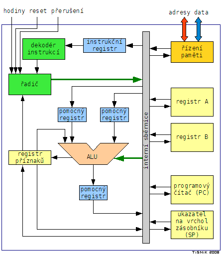
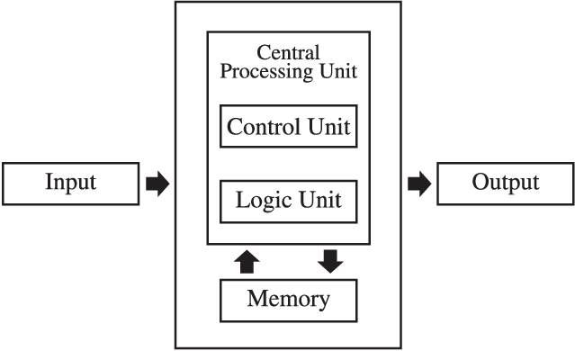
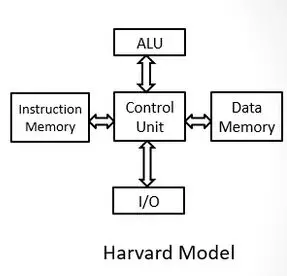
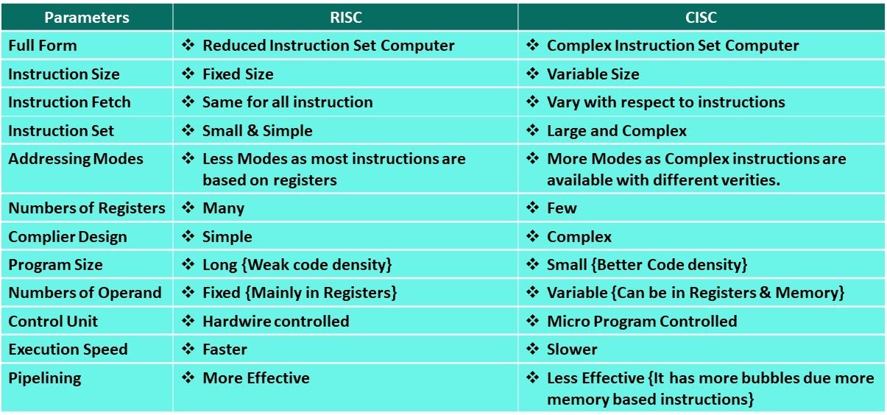

# Mikrokontroléry (mcu) – základní pojmy

`Vysvětlení pojmu mikrokontrolér, harvardská a von Neumannova architektura, hlavní vlastnosti
mikrokontrolérů Atmel AVR, popis blokového schématu`

## MCU

- Microcontroler unit
- **Mikroprocesor**
  - **Řadič**
    - řídí tok dat a instrukcí uvnitř procesoru
    - obsahuje dekodér instrukcí
    - řídí zpracování dat
  - **ALU**
    - provádí výpočty a aritmetické operace
  - **Registry**
    - Dočasné úložište procesoru
  - **Paměť instrukcí**
    - zde jsou uloženy kroky které mají být provedeny
  - **Paměť**
    - zde jsou uložena data se kterými program pracuje

## Von Neumann

- architektura
- zpracování je sekvenční
- paměť programu i instrukcí je spojena
- pouze jedna sběrnice na přenos instrukcí a dat

## Hardvard

- architektura
- paměti jsou odděleny
- každá pamět má svojí sběrnici (lze zasahovat do obou najednou)
- rychlejší a efektivnější zpracování dat

## RISC a CISC

- `Reduced Instruction Set Computer`
- `Complex Instruction Set Computer`

## Atmel AVR

- rodina 8bit kontrolerů
