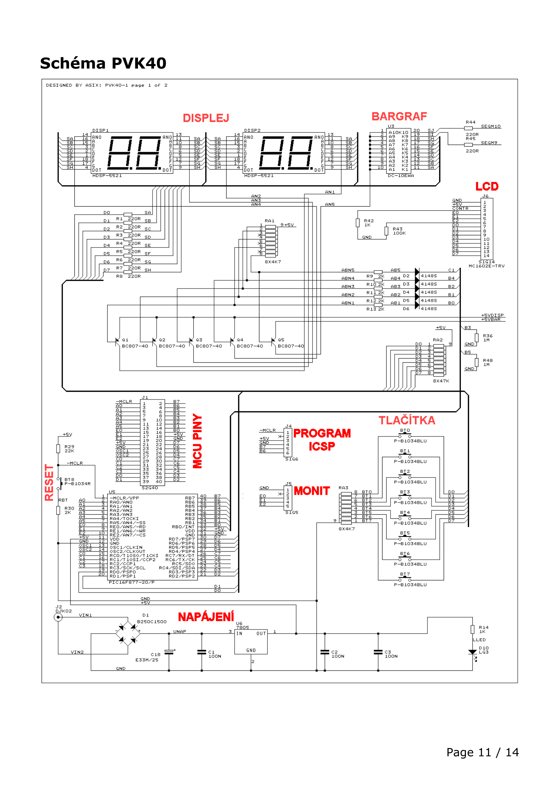

# Připojování externích periferií k mcu

`Tlačítka, klávesnice, LED, segmentové a inteligentní displeje`

## Tlačítka

### Basic

- `+` jednoduché zapojení
- `+` každé tlačítkío má vlastní vstup
- `+` lze mačkat více součaně
- `-` vysoká odsazenost pinů (každé tlačítko má svůj)

### Pomocí multiplexu

- `+` možný počet tlačítekm je **2^počet pinů - 1**
- `+` lze mačkat více současně
- `-` pomalé čtení (čte se postupně)
- `-` externí součástka (point of failure)

- pomocí CLK singnálu z MCU se přičítá v čítači
- čítač ukazuje na aktuální adresu MUX
- Přečteme data z MUX

### Dekodér

- ?

### Matrix

- `+` počet tlačítek je roven **2^(počet pinů/2)**
- `-` když zmáčknu 2 a více kláves, nemusí se přečíst správně (**Phantom button**)
  - jakoby do tvaru L

- využívá se na **klávesnice**

- když je tlačítko zmáčknuto víme jeho polohu (horizontální a vertikální)

