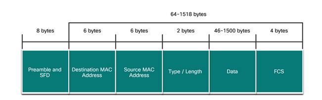

# Vrstva síťového přístupu, Ethernet

`Protokol IEEE 802.3, MAC vrstva, IEEE 802.2, LLC vrstva, unicast, broadcast, multicast, anycast
ARP protokol, popis rámce Ethernet, PPP
Média, modulace, šířka pásma, propustnost 
Druhy médií – kabely, optická vlákna, bezdrátové sítě - základní principy činnosti
Značení kabelů a konektorů, kategorie kabelů, zapojení konektorů
Optická vláken a konektory (SMF/MMF), základní princip činnosti
`

## Základní popis

- zabývá se vrstvou L1 a L2 v modelu OSI/IOS
- Vrstva síťového přístupu v TCP/IP = L1+L2

### IEEE 802.3 (Ethernet)

- určuje specifikace **fyzické** a **linkové vrstvy** Ethernetu
- **fyzické** propojení uzlů

### MAC

- media access controll
- MAC adresy -> spjaty s NIC
- identifikátor síťového zařízení
- popužívají se na komunikaci v místní síťi
- PDU se nazývá Frame (Rámec)
- broadcats se šíří až po router
- MAC se stará o směrování rámce sítí

### LLC

- IEEE 802.2
- spojuje link-local s síťovou
- řídí tok dat mezi síťovými zařízeními
- kontroluje správnost přenosu
- udržuje korektnost datového rámce
- zabaluje data ze třetí vrstvy do rámce
- rozhraní mezi MAC podvrstvou a síťovou vrstvou (L3)
- umožnuje použití jak IPv4 a IPv6
- LLC se stará o obsah a formátování rámce

### unicast, broadcast, multicast, anycast

- **unicast**
  - jeden příjemce
- **multicast**
  - skupina příjemců
- **broadcast**
  - všichni v místní síťi
  - samé jedničky
  - nedostane se přes router
- **anycast**
  - více zařízení má stejné adresy
  - cílem je pro mě "nejbližší" zařízení
  - "vzdálenost" závisí na ceně cesty v protokolu BGP

### ARP

- address resolution protocol
- získání MAC adresy z IP adresy

### Frame

- preambuli (identifikuje začátek rámce) - střídající se 1 a 0
- SFD (start frame delimiter) - značí konec preambule
- hlavičku (obsahuje zdrojovou a cílovou MAC adresu, délku)
- data (max 1500 oktetů)
- kontrolní posloupnost rámce (kontrolní součet dat) - 32bit CRC (cyklický redundantní součet)
- mezeru mezi packety (časový interval, kdy nic nesmí vysílat - odděluje packety)

### Média

- **Měď**
  - kroucená dvoulinka
  - konektor: RJ-45
  - **UTP**
    - Nestíněné
  - **STP**
    - stíněné
    - neruší se
    - minimalizace crosstalku
    - vyšší rychlosti
  - **CAT 5e**
    - maximální rychlost dosahuje: 1Gbps
    - nejrozšířenější
    - šířka pásma: 100 MHz
  - **CAT 6**
    - šířka pásma: 250 MHz
- **Optické vlákno**
  - odolné proti **elektromagentickému rušení**
  - vyšší přenosová rychlost
  - přenos na vetší vzdálenosti
  - konektory: ST (straight tip) a LC (Lucent connector)
  - **SMF**
    - single mode fiber
    - tenké vlákno (jádro 8 mikrometrů)
    - pouze jeden paprsek světla
    - používají se lasery
  - **MMF**
    - multi mode fiber
    - v jádře je více paprsků
    - přenso na menší vzdálenost oproti SMF
    - není potřeba laser stačí LED

### Modulace

- kódování Manchester
- PSK (phase shift keying, fázová modulace)
- QAM (quad amplitude modulation, kombinace amplitudové a fázové modulace)

## Šířka pásma

- maximální teoretické množství dat za čas

## Propustnost

- opravdové množství dat za čas

## Přenosová rychlost

- propustnost ovlivněná vnějšími vlivy (rušení atd.)
