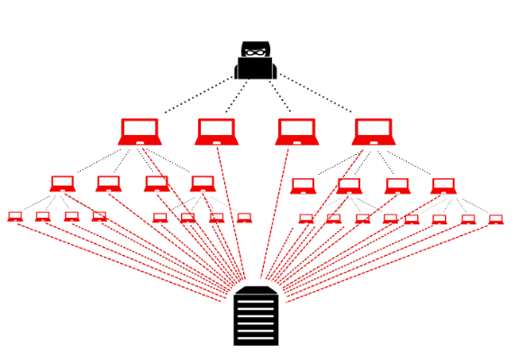
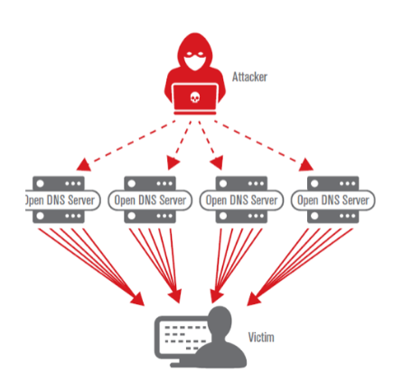
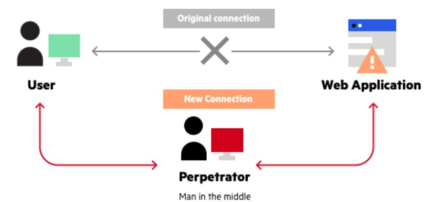

# Problematika bezpečnosti

`Fyzická bezpečnost, sociální inženýrství, zranitelnost, exploit, hrozba
Podvržení adres, zesilovač, DoS, DDoS, Man in the Middle (MITM), průzkumné útoky
Malware trojský kůň, virus, červ, Botnet (zombie), ransomeware
Zabezpečení přepínače (včetně port security) proti zranitelnostem (ARP flooding, DHCP snooping a starvation,,VLAN, STP, CDP)
Zabezpečení koncových zařízení včetně bezdrátových
`

## Pojmy

- **ideální případ**
  - dům bez dveří a okne
  - **bezpečný**
- **zranitelnost**
  - **dveře do domu**
- **exploit**
  - nástroj proti zranitelnosti
  - např. **páčidlo**
- **hrozba**
  - člověk co vezme páčidlo a vylomí dveře
  - v sítích: **hacker**

## Fyzická bezpečnost

- Zabezpečení HW
- například
  - mříže
  - vránice
  - ale taky samotná poloha serveru
    - teplota
    - vlhkost

## Sociální inženýrství

- techniky zenužití důvěry člověka
- je využíváno silné citové manipulace
- **phishing**
  - útočník zasílá falešný odkaz (vypadá jako legitimní stránka)
- **spear phishing**
  - útočník se zaměřuje na určitou skupinu lidí (rybáři…)
- **whaling**
  - phishing na vysoké představitele firem
- **Vishing/Smishing**
  - phishing pomocí hlasu/sms zpráv
- **Vydávání se za technika**

## Útoky

### DoS

- **denial-of-service**
- cílem je cílovou službu znefunkčnit a znepřístupnit ostatním uživatelům
- zaplavení cíle
- útočník posílá velké množství requestů
- každý request má falešnou zdrojovou adresu

### DDoS

- podobný jako DoS
- z velkého množství počítačů (**botnet**)

### Amplification attack

- útočník posílá requesty se zdrojovou adresou oběti
- server posílá oběti velké množství odpovědí

### Man in the middle

- muž uprostřed
- útočník přesměruje spojení přes sebe
- většinou infekce ARP cache (tváří se jako brána)

### Průzkumné útoky

- zjištění stavu sítě
- např. otevřené porty
- **NMAP** – nejpoužívanější program

### Malware

- **Virus**
  - po spuštění infikuje jiné programy
- **Worm**
  - šíří se samočinně
- **Trojan**
  - zabalen do legitnmního programu
- **Botnet**
  - velké množství infikovaných počítačů ovládaných hackerem
- **Ramsomware**
  - zašifruje disk
  - uživatel o něm neví (dokud není už pozdě)
  - útočník žádá výkupné

## Switch security

- **ARP flooding** – útočník zasílá ARP response bez request
- **CAM flooding** – switch se chová jako HUB
- **DHCP spoofing** – útočník se tváří jako DHCP server (dva servery, špatná funkcionalita)
- **DHCP starvation** – útočník si vyžádá všechny dostupné adresy pravého DHCP serveru, potom rozesílá svoje adresy
- **VLAN double tagging** – na první switch pošlu data s Native VLAN, ten je rozbalí a pošle do jiné VLAN (Native nezahazuje)
- **VLAN spoofing** – připojím se na TRUNK port switche a natáhnu si k sobě VLAN

## Zabezpečení koncových zařízení

- antimalware
