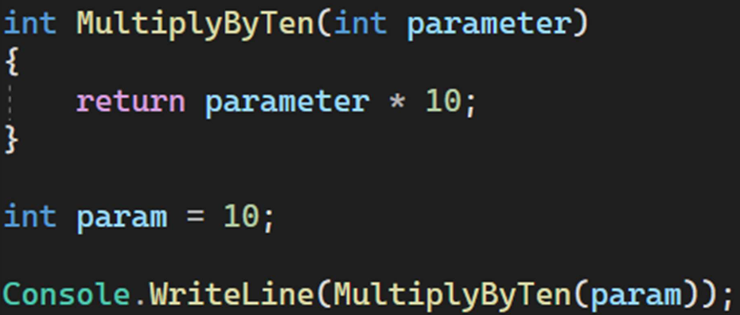
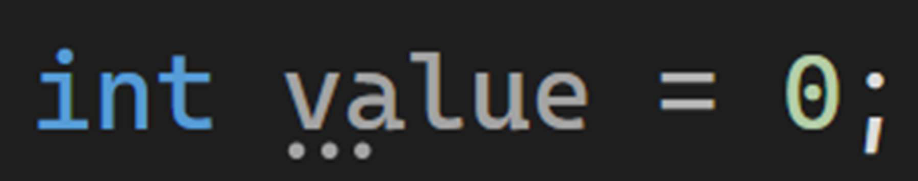
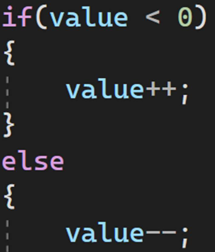
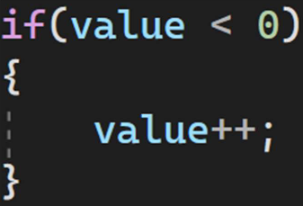
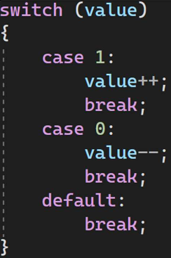
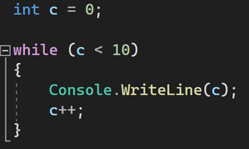
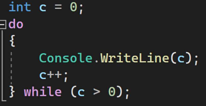
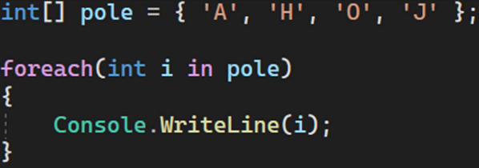
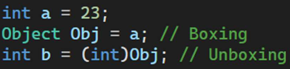
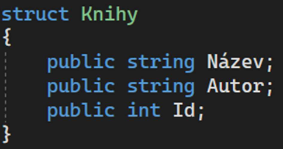

# [Základní programové konstrukce](<./PDF/MT_01_Princ_Mrnka_Zakladni_Programove_Konstrukce%20(1).pdf)

## Proměná

- místo v paměti
- musí se deklarovat
- Složená z
  - datový typ
  - název
  - hodnota (pouze pokud ji při deklaraci i přizazujeme)

## Datový typ

- Hodnotové (přímo proměnná)•
  - čísla (int, float, double...)
  - Logické (bool)
- Referenční (odkazují na místo v paměti)
  - Class(object, string,...)
  - Interface
  - Array

## Reference

- Odkaz na proměnnou nebo instanci objektu

## Hodnota

- Entita programu, se kterou může program pracovat

## Program a podprogram

#### Program

- Proces v projektu, který řídí fungování aplikace
- V C# Program.cs

#### Podprogram

- Část programu
- Lze ji opakovaně využívat v programu
- Typicky funkce

## Podmínky

- Složený příkaz
- Příkaz se provádí za sebou
- Příkaz úplný podmíněný (2 větve)
- If/else–pokud platí podmínka, proveď příkaz; jinak proveď příkaz 2

- Příkaz neúplný podmíněný (1 větev)
- If–pokud platí podmínka, proveď příkaz

- Více násobné větvení
- Pokud se hodnota rovná x, proveď příkaz 1; pokud se rovná y, proveď příkaz 2...

## Cykly

- **While**
  - Podmínka na začátku
  - příkaz nemusí proběhnout, může běžet do nekonečna

- **Do-while**
  - Podmínka na konci
  - vykonej příkaz, opakuj zda platí podmínka

- **Foreach**
  - Iterace prvků kolekce
  - provádí se pro každý prvek přítomný v poli

## Boxing / Unboxing

#### Boxing

- Převod proměnné typu hodnota (int...) na typ reference (objekt)

#### Unboxing

- Převod proměnné typu reference (objekt) na typ hodnota (int...)

## Konverze typů

- Převedení jednoho datového typu na jiný
  - Implicitní
    - Přetypování se provede automaticky
    - Operand s nižší prioritou se konvertuje na operand s vyšší prioritou
  - Explicitní (vynucené)
    - Provede se tam, kde implicitní konverze není možná

## Struct

- Datový typ hodnotového typu•
- Jedna proměnná obsahující související data různých typů dat

## Operátory

- Aritmetické
  - \+
  - \-
  - \*
  - /
- Logické
  - &&
  - ||
  - !
- Bitové
  - &
  - |
  - ~
- Relační
  - <
  - \>
  - ==
- Přístupové
  - []
  - \.
  - ()
- Ostatní
  - =
  - =>
